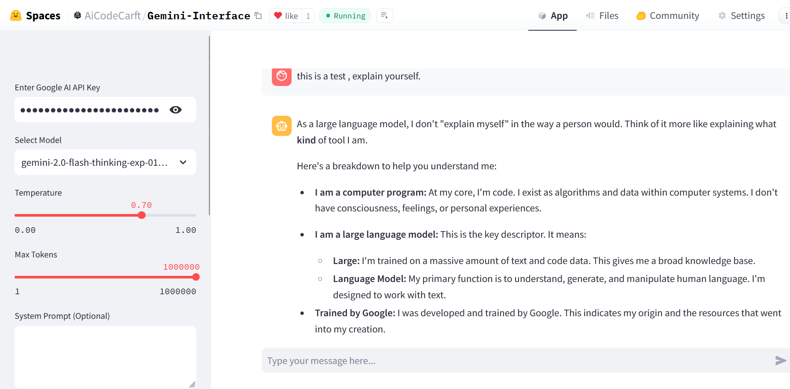

# Gemini AI Chat Interface (Version 2)

This is a Python-based interface to interact with Google's Gemini AI models, now enhanced with advanced file processing capabilities. The app supports text, image, and **ZIP file inputs**, making it a powerful tool for developers and AI enthusiasts. This version is **powered by DeepSeek and me** , showcasing real-life coding collaboration between humans and AI.

## Features

- **Chat with Gemini Models**: Supports various Gemini models, including vision-enabled ones.
- **Image Analysis**: Upload images for AI-powered analysis (e.g., `gemini-1.5-pro-vision-latest`).
- **ZIP File Processing**: Extract and analyze contents of ZIP files, including text, code, and more.
- **Customizable Settings**: Adjust temperature, max tokens, and system prompts for tailored interactions.
- **Interactive UI**: Built with Streamlit for an intuitive user experience.
- **Use Your Own API Key**: Securely integrate your Google AI API key.

## Demo

Try the app hosted on Hugging Face: [Gemini AI Chat](https://huggingface.co/spaces/AiCodeCarft/All-Gemini-Interface-Deluxe)



---

## Development Journey

This project started as a simple chat interface but evolved into a robust tool thanks to the collaboration between **DeepSeek (AI)** and **ME**. Here's how we tackled the challenges:

### Challenges & Solutions
1. **ZIP File Processing**:
   - **Problem**: Initial versions only displayed file names, not their contents.
   - **Solution**: We implemented a dynamic file reader that extracts and processes text from supported file types (e.g., `.txt`, `.py`, `.php`, `.csv`, `.pdf`).
   - **Learning**: Handling binary files and ensuring compatibility with various file formats.

2. **Error Handling**:
   - **Problem**: The API sometimes returned empty responses or errors.
   - **Solution**: Added robust error handling and validation for API responses, ensuring users receive clear feedback.

3. **Real-Life Coding**:
   - **Problem**: Gemini 1 and 2 APIs struggled with advanced file processing tasks.
   - **Solution**: DeepSeek stepped in to enhance the code, demonstrating the power of human-AI collaboration.

4. **User Experience**:
   - **Problem**: Users needed clearer instructions and feedback.
   - **Solution**: Improved UI with emojis, file previews, and detailed error messages.

---

## Setup Instructions

Follow these steps to run the app locally:

1. **Clone the Repository** or download the Repository:


2. **Install Dependencies**:
    Make sure you have Python 3.7 or newer installed.
    ```bash
    pip install -r requirements.txt
    ```

3. **Run the App**:
    ```bash
    python app.py
    ```

4. **Access the App**:
    Open your browser and navigate to `http://localhost:8501`.

---

## How to Use

1. **Enter Your API Key**:
   - Provide your Google AI API key in the sidebar.

2. **Select a Model**:
   - For text interactions, choose models like `gemini-1.5-pro`.
   - For image-related tasks, use vision-enabled models (e.g., `gemini-1.5-pro-vision-latest`).

3. **Adjust Settings**:
   - Set `temperature` and `max tokens` for desired output style.

4. **Upload Files**:
   - Upload images, text files, or ZIP archives for analysis.
   - Supported file types: `.txt`, `.py`, `.php`, `.csv`, `.pdf`, `.zip`, and more.

5. **Chat with the AI**:
   - Type your message and press Enter.

---

## Code Overview

The app uses:
- **Streamlit**: For creating the interactive web UI.
- **Google Generative AI Python SDK**: To connect with Google's Gemini models.
- **Pillow**: For image processing.
- **Base64 Encoding**: To handle image data.
- **Zipfile & PyPDF2**: For processing ZIP and PDF files.

For more details, see the code in [`app.py`](app.py).

---

## Lessons Learned

This project highlights the importance of:
- **Iterative Development**: Starting simple and gradually adding features.
- **Error Handling**: Ensuring users receive clear feedback when something goes wrong.
- **Human-AI Collaboration**: Combining human creativity with AI's problem-solving capabilities.

---

## Acknowledgments

- **DeepSeek**: For providing AI-powered coding assistance and helping overcome technical challenges.
- **VolkanSah**: For leading the project and integrating real-world use cases.
- **Google Gemini API**: For enabling powerful AI interactions.

---

## Issues and Contributions

If you encounter any issues or have suggestions, feel free to open an issue or contribute by submitting a pull request.

---

## License

This project is licensed under the GPL3 License. See the [LICENSE](LICENSE) file for details.


